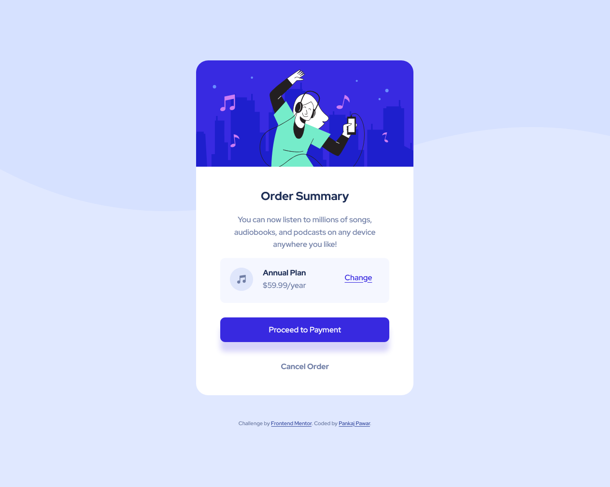
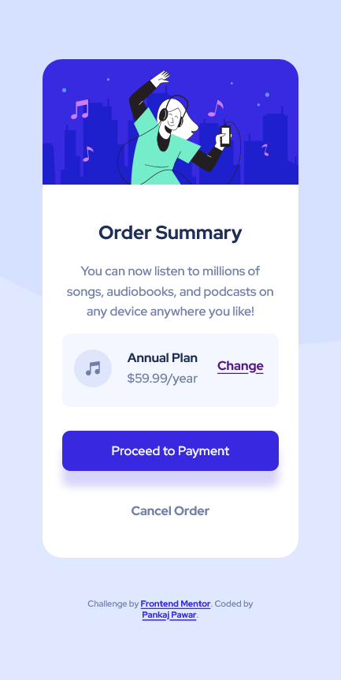

# Frontend Mentor - Order summary card solution

This is a solution to the [Order summary card challenge on Frontend Mentor](https://www.frontendmentor.io/challenges/order-summary-component-QlPmajDUj). Frontend Mentor challenges help you improve your coding skills by building realistic projects. 

## Table of contents

- [Overview](#overview)
  - [The challenge](#the-challenge)
  - [Screenshot](#screenshot)
  - [Links](#links)
- [My process](#my-process)
  - [Built with](#built-with)
  - [What I learned](#what-i-learned)
  - [Continued development](#continued-development)
  - [Useful resources](#useful-resources)
- [Author](#author)
- [Acknowledgments](#acknowledgments)

## Overview

### The challenge

Users should be able to:

- See hover states for interactive elements

### Screenshot




### Links

- Solution URL: [Github Link For Repo](https://github.com/DamnItAzriel/stats-preview-card-component)
- Live Site URL: [Order Summary Component](https://order-summary-component-wheat.vercel.app/)

## My process
- For desktop:
  - HTML
    - Image Div
    - Content Div
    - Plan Div
      - Image Div
      - Annual Div
      - Change Div
    - Button Div
    - Cancel Div
  - CSS
    - border boxsizing
    - margin 0px auto
    - background image svg
    - text align
    - color padding margin line-height
    - background image none for margin
    - plan div set flex
      - bg-color padding margin
      - border-radius
      - Image div
        - margin-right
        - float left
      - Annual div
        - margin-right
      - Change div
        - padding-top
        - on hover change color
        - cursor pointer
      - Pay button in div
        - margin border-radius box-shadow
        - a:link a:hover
        - button
          - width:100%
          - inherit (font color outline)
          - bg border:none
          - border-radius
          - bg-color
          - button:hover- change color, bg-color
      - Cancel div
        - decoration none
        - on hover change color
- For mobile
  - Just changed padding and margins at few places
  - Adjusted image such that it will be resized when browser width reduces but not when browser size is increased

### Built with

- Semantic HTML5 markup
- CSS custom properties
- Flexbox

### What I learned

- Used flex for first time somewhere as I felt the need. Loved using that. 
- Learnt to auto adjust image when browser width is reduced
- Learnt to make a button interactive when hovered and it looks nice. Also added a box shadow

```css
/*Image auto reduce when browser width is reduced but when incrased doesnt increase image*/
 #heroImage img{
        width: auto;
        max-width: 100%;
        height: auto;
    }
/*Flex*/

```

### Continued development
- I would like to try doing the proceed to payment div with a link attribute instead of a button. I thought of doing this first but then I resorted to a button. Reason behind this was I could increae the button width so that when a user hovers anywhere on the button it shows a cursor. Would like to implement same with a link to check if its possible or not.

### Useful resources

- [w3schools flexbox](https://www.w3schools.com/css/tryit.asp?filename=trycss3_flexbox) - Helped me use flex in this webpage

## Author

- Website - [Pankaj Pawar](https://www.twitter.com/DamnItAzriel)
- Frontend Mentor - [@DamnItAzriel](https://www.frontendmentor.io/profile/DamnItAzriel)
- Twitter - [@DamnItAzriel](https://www.twitter.com/DamnItAzriel)

## Acknowledgments
I would like to thank frontend mentor who created these projects which helps begineers like me to practice their HTML and CSS skills.
